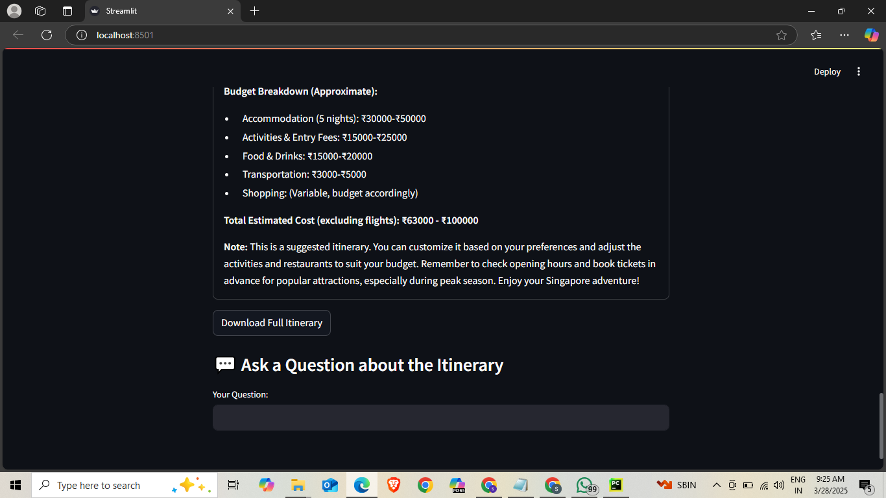

# 🌍 Travel Itinerary Planner

## Overview
The Travel Itinerary Planner is an intelligent Streamlit application that generates personalized travel itineraries using Google's Gemini AI. This tool helps travelers create detailed, customized trip plans based on their specific preferences, budget, and interests.

## 🚀 Features
* **Personalized Itinerary Generation**
    * Custom travel plans based on destination, dates, and preferences
    * Budget-friendly recommendations
    * Detailed day-by-day breakdown
* **Budget Estimation**
    * Automatic budget calculation
    * Expense breakdown across categories
    * Support for different budget ranges (Budget, Mid-range, Luxury)
* **Interactive AI Assistance**
    * Chatbot feature to ask questions about your itinerary
    * Real-time travel advice and recommendations
* **User-Friendly Interface**
    * Simple, intuitive Streamlit dashboard
    * Easy input of travel preferences
    * Downloadable itinerary option

## 🖼️ Results
The application provides users with:


  
* An estimated budget for the trip, broken down into categories like accommodation, food, and activities.

  
* Key highlights of the trip, including top attractions and unique experiences.

  
* The ability to download the itinerary as a text file.
* A chat interface to ask questions about the generated itinerary.

## 🛠️ Prerequisites
Before you begin, ensure you have the following:

* Python 3.8+
* Google Cloud account
* Gemini API key

## 📦 Installation
Clone the repository:
```bash
git clone [https://github.com/your-username/travel-itinerary-planner.git](https://github.com/your-username/travel-itinerary-planner.git)
cd travel-itinerary-planner
```
Create a virtual environment:
```bash
python -m venv venv
source venv/bin/activate  # On Windows, use `venv\Scripts\activate`
```
Install required dependencies:
```bash
pip install -r requirements.txt
```
Create a `.env` file in the project root:
```
GOOGLE_API_KEY=your_google_api_key_here
```

## 🔧 Configuration
### Environment Variables
* `GOOGLE_API_KEY`: Your Google Generative AI API key

## 🚀 Running the Application
```bash
streamlit run travel_planer.py
```

## 💡 How to Use
1.  Enter your destination.
2.  Select travel dates.
3.  Choose your budget range.
4.  Select trip purpose and interests.
5.  Click "Generate My Itinerary".

### Itinerary Features
* Personalized daily plans
* Budget breakdown
* Key attractions and experiences
* Downloadable itinerary


## 📋 Requirements
Create a `requirements.txt` with these dependencies:
```
streamlit
google-generativeai
python-dotenv
```
